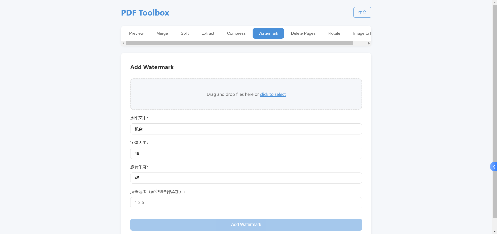

# PDF Toolbox

**English** | [简体中文](./README.md)

A **fully offline** PDF processing Web tool. No installation or deployment needed. Integrates **PDF preview, merge, split, extract, compress, watermark, delete pages, rotate, image to PDF** and other common operations — all processed locally with no server uploads.

## Preview




## Features

### 🔀 Merge PDF
- Select multiple PDF files and merge them into a single document

### ✂️ Split PDF
- Split each page into individual files
- Split by custom page ranges

### 📄 Extract Pages
- Extract specific pages from a PDF into a new file

### 🗜️ Compress PDF
- Low / Medium / High quality presets
- Ideal for scanned documents and image-based PDFs

### 🖼️ Image to PDF
- Supports PNG, JPEG, WebP formats
- Each image becomes a PDF page

### 👁️ Preview PDF
- Embed a native PDF viewer directly in the browser

### ❌ Delete Pages
- Remove specific pages by page number

### 🔄 Rotate Pages
- Supports 90°, 180°, 270° rotation
- Apply to specific pages or all pages

### 💧 Add Watermark
- Custom text, font size, and color
- Supports rotation angle and page range

## Usage

Open `index.html` in your browser — no installation or deployment needed.

```bash
# Option 1: Double-click index.html to open
# Option 2: Local server (recommended, avoids CORS issues)
python -m http.server 8080
# Visit http://localhost:8080
```

## Tech Stack

- **HTML5 + CSS3 + JavaScript** (vanilla, no framework)
- **pdf-lib** — PDF creation and editing
- **pdf.js** — PDF rendering and preview
- **Canvas** — Image downsampling for compression

## Notes

- All operations are performed locally — **no files are uploaded to any server**
- Chrome / Edge latest version recommended for the best experience
- Compression works best on scanned/image-based PDFs

## Changelog

See [VERSION.md](./VERSION.md) for detailed release notes.

## Highlights

- ✨ **Fully offline**, no internet required
- 🔒 **Private & secure**, no server uploads
- 🌐 **Dual platform**: Desktop + Web
- 🌍 **Bilingual UI**: Chinese / English switchable
